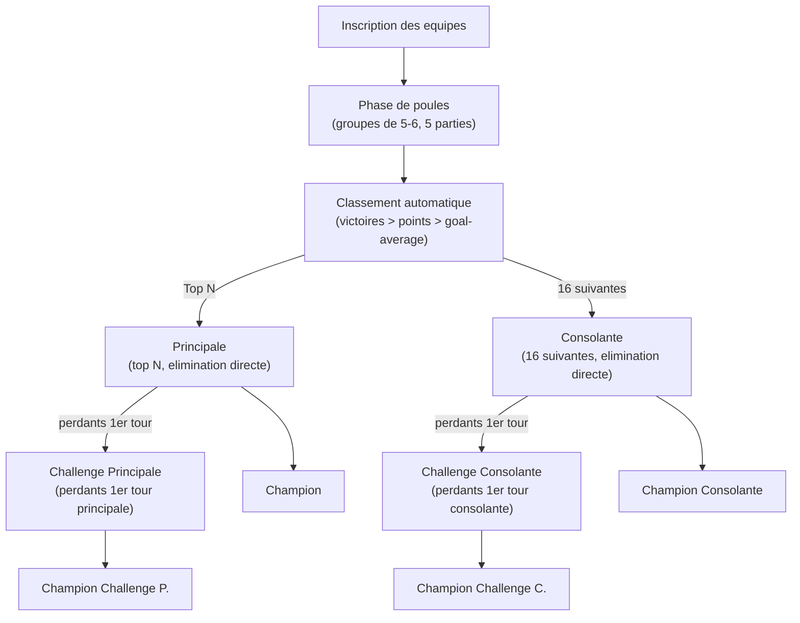
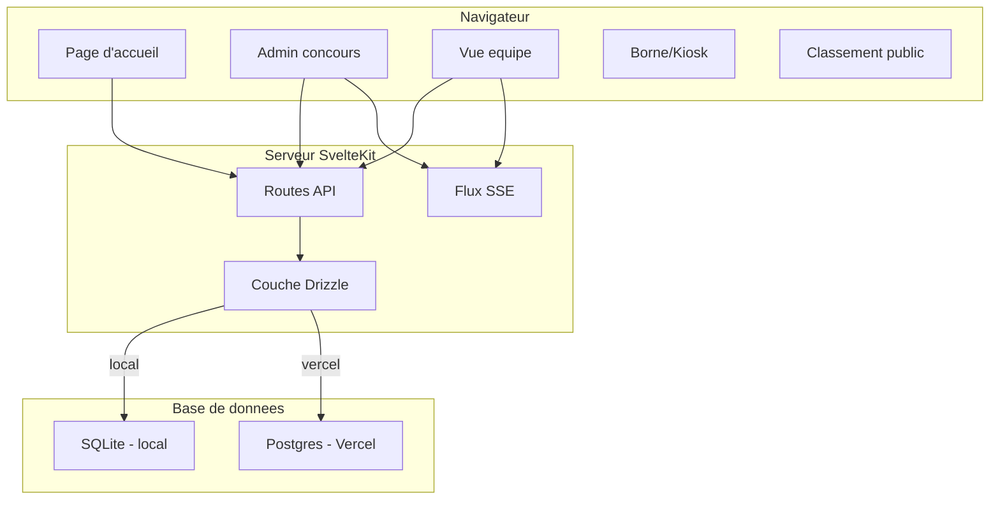

# Visez Le Maitre — Plan Technique

## Presentation

**Visez Le Maitre** — application web de gestion de concours de palet vendeen. Le nom fait reference au maitre, le petit palet cible. Entierement en francais. Fonctionne en local (SQLite) ou deployee sur Vercel (Postgres). Interface mobile-first et minimaliste.

## Stack Technique

- **Framework** : SvelteKit (Svelte 5, runes)
- **ORM** : Drizzle ORM
- **BDD (local)** : SQLite via `better-sqlite3`
- **BDD (Vercel)** : Vercel Postgres (Neon) via `@vercel/postgres`
- **Style** : Tailwind CSS
- **Notifications** : Server-Sent Events (SSE)
- **QR Code** : package npm `qrcode` (rendu SVG)
- **Deploiement** : Adaptateur Vercel (production), adaptateur Node (local)

## Format du Concours de Palet Vendeen

### Regles officielles

Un concours se deroule en plusieurs phases :

1. **Phase de poules** — groupes de 5 ou 6 equipes, 5 parties par equipe
2. **Classement** — victoires > points marques > goal-average (difference points marques - points encaisses)
3. **Poule finale (Principale)** — les N meilleures equipes (16 ou 32 selon config admin), elimination directe par tirage au sort
4. **Consolante** — les 16 equipes suivantes au classement, elimination directe par tirage au sort, finale en score configurable (defaut 15 points)
5. **Challenge principale** (optionnel) — perdants du 1er tour de la principale, elimination directe
6. **Challenge consolante** (optionnel) — perdants du 1er tour de la consolante, elimination directe

La principale, la consolante et les challenges se jouent en parallele.

### Deroulement type



## Architecture



## Schema de la Base de Donnees

Code en anglais, interface en francais.

| Table | Columns |
|-------|---------|
| **contests** | `id` (uuid), `name`, `status` (registration / pools / finals / completed), `team_size` (1, 2, or 3), `score_target` (default 13), `score_target_consolante_final` (default 15), `nb_qualified` (16 or 32), `challenges_enabled` (boolean), `created_at`, `completed_at` (nullable), `last_activity_at` |
| **admin_tokens** | `token` (uuid, PK), `contest_id` (FK) |
| **teams** | `id` (uuid), `contest_id` (FK), `name`, `token` (uuid, unique), `pin` (text, 4-6 digits, unique per contest), `created_at` |
| **team_members** | `id` (uuid), `team_id` (FK), `name` |
| **pools** | `id` (uuid), `contest_id` (FK), `name` (e.g. "Poule A"), `pool_number` |
| **seed_groups** | `id` (uuid), `contest_id` (FK), `name` (nullable, e.g. "Club X") — all teams in this group must be in different pools |
| **seed_group_teams** | `seed_group_id` (FK), `team_id` (FK) |
| **pool_teams** | `pool_id` (FK), `team_id` (FK) |
| **phases** | `id` (uuid), `contest_id` (FK), `type` (pools / main / consolante / challenge_main / challenge_consolante), `status` (pending / in_progress / completed) |
| **matches** | `id` (uuid), `phase_id` (FK), `pool_id` (FK, nullable — for pool matches), `round_number`, `bracket_position` (nullable — for elimination), `team1_id` (FK, nullable), `team2_id` (FK, nullable), `score_team1` (integer, nullable), `score_team2` (integer, nullable), `submitted_by` (FK to team, nullable), `confirmed` (boolean, default false), `winner_id` (FK, nullable), `status` (pending / in_progress / score_submitted / score_disputed / completed) |

### Seeding (contraintes de separation)

Avant de lancer les poules, l'admin peut definir des groupes de separation :
- Via l'interface admin, il cree un groupe (ex: "Club des Herbiers") et y ajoute toutes les equipes concernees (2, 3, 4...)
- Toutes les equipes d'un meme groupe seront placees dans des poules differentes
- Stocke dans les tables `seed_groups` + `seed_group_teams`
- L'algorithme de repartition en poules place d'abord les equipes sous contrainte dans des poules differentes, puis repartit le reste aleatoirement
- Si les contraintes sont impossibles a satisfaire (plus d'equipes dans un groupe que de poules disponibles), l'admin est prevenu et peut ajuster

### Classement des poules (vue calculee)

Pour chaque equipe dans une poule :
- `matchs_gagnes` — nombre de victoires
- `points_marques` — somme des points marques
- `points_encaisses` — somme des points encaisses
- `goal_average` — points_marques - points_encaisses

Tri : `matchs_gagnes` DESC, `points_marques` DESC, `goal_average` DESC

## Structure des Routes

```
src/routes/
  +page.svelte                        — Accueil : creer un concours
  join/[id]/+page.svelte              — Inscription equipe
  contest/[id]/
    +page.svelte                      — Vue equipe (statut, score)
    kiosk/+page.svelte                — Borne (inscription + jeu par PIN)
    standings/+page.svelte            — Classement des poules (public)
    admin/+page.svelte                — Tableau de bord admin concours
  admin/
    +page.svelte                      — Connexion admin app
    dashboard/+page.svelte            — Gestion globale (tous les concours)

src/routes/api/
  contests/
    +server.ts                        — POST : creer concours, GET : lister (admin app)
    [id]/
      +server.ts                      — GET : info concours, DELETE : supprimer
      join/+server.ts                 — POST : inscription equipe
      start-pools/+server.ts          — POST : demarrer poules (repartition + generation matchs)
      start-finals/+server.ts         — POST : demarrer finales (tirage au sort auto)
      teams/+server.ts                — GET : liste des equipes
      standings/+server.ts            — GET : classement des poules
      seed-groups/+server.ts          — GET/POST/DELETE : groupes de separation
      matches/[matchId]/
        score/+server.ts              — POST : soumettre score
        confirm/+server.ts            — POST : confirmer score
        force/+server.ts              — POST : admin force le score
      status/+server.ts               — GET : statut de l'equipe (token requis)
      events/+server.ts               — GET : flux SSE
  admin/
    login/+server.ts                  — POST : valider ADMIN_PASSWORD
    logout/+server.ts                 — POST : deconnexion
  cron/
    cleanup/+server.ts                — Nettoyage des concours > 7 jours
```

## Strategie d'Authentification

### Niveau concours (par token, sans login)

- **Token admin concours** : retourne a la creation, stocke dans `localStorage` sous `admin_token_[concours_id]`
- **Token equipe** : retourne a l'inscription, stocke dans `localStorage` sous `team_token_[concours_id]`
- Transmis via header `Authorization: Bearer <token>`
- Bouton "Copier le token" + option "Se reconnecter" (coller un token) pour equipes et admins de concours

### Niveau application (par mot de passe)

- Mot de passe via variable d'environnement `ADMIN_PASSWORD`
- Cookie de session HTTP-only signe apres connexion
- Verifie via hook SvelteKit (`src/hooks.server.ts`)

## Interface Utilisateur

### Principes

- Mobile-first, minimaliste — grandes zones tactiles, colonne unique
- Interface utilisateur entierement en francais (labels, messages, statuts)
- Code source en anglais (noms de variables, fonctions, tables, commentaires)
- Police systeme, espacement genereux, fort contraste

### Vue Equipe (`/concours/[id]`)

Une seule carte avec le statut actuel :

| Phase | Etat | Affichage |
|-------|------|-----------|
| Inscription | Inscrit | "Votre equipe est inscrite. En attente du debut du concours." |
| Poules | Match a jouer | "Prochain match : [adversaire] — Terrain X" |
| Poules | Score a soumettre | Formulaire de saisie du score |
| Poules | En attente confirmation | "Score soumis (X-Y). En attente de confirmation." |
| Poules | Score conteste | "L'adversaire propose X-Y. Accepter ou resoumettre ?" |
| Poules | Matchs termines | "Phase de poules terminee. Classement : Xeme" |
| Finales | Match a jouer | "Principale — Match contre [adversaire]" |
| Finales | Eliminee | "Eliminee en [phase]. Classement final : Xeme" |
| Finales | Championne | "Felicitations ! Vous etes champions !" |

### Borne / Kiosk (`/concours/[id]/kiosk`)

- **Phase inscription** : formulaire nom equipe + joueurs + PIN, bouton "Equipe suivante"
- **Phase jeu** : saisie PIN, affichage statut, soumission score, deconnexion
- Pas de localStorage — session ephemere

### Admin Concours (`/concours/[id]/admin`)

- **Inscription** : QR code + lien + liste des equipes inscrites
- **Poules** : classement en temps reel, statut de chaque match, forcer un score
- **Finales** : arbre d'elimination pour chaque phase (principale, consolante, challenges), forcer un score
- Boutons d'action : "Demarrer les poules", "Lancer les finales"
- En cas d'egalite parfaite au classement : possibilite de creer un match d'appui

### Classement Public (`/concours/[id]/classement`)

- Accessible sans token
- Affiche le classement de chaque poule (victoires, points, goal-average)
- Mis a jour en temps reel via SSE

## Notifications SSE

- Endpoint : `GET /api/concours/[id]/events?token=<team_token>`
- Evenements : `event: refresh` (equipe), `event: concours_update` (admin)
- Declencheurs : score soumis/confirme/force, changement de phase, nouveau match
- Reconnexion automatique via `EventSource`
- Fallback : rafraichissement manuel

## Tirage au Sort Automatique

Quand l'admin lance les finales :
1. Calcul du classement final des poules
2. Les N premieres → Principale (shuffle Fisher-Yates, generation arbre)
3. Les 16 suivantes → Consolante (idem)
4. Apres le 1er tour, si challenges actives : perdants → Challenge Principale / Challenge Consolante

## Nettoyage Automatique (TTL 7 jours)

- `completed_at` : pose quand le concours passe en "termine"
- `last_activity_at` : mis a jour a chaque mutation
- Suppression si `completed_at < now - 7j` OU `last_activity_at < now - 7j`
- Vercel : cron quotidien (`vercel.json`)
- Local : hook SvelteKit debounce (1x/heure)

## Admin Application

- `/admin` : connexion par mot de passe
- `/admin/dashboard` : liste de tous les concours, supprimer, forcer la fin, stats

## Logique Metier

```
src/lib/server/
  db/
    schema.ts           — Schema Drizzle complet
    index.ts            — Dual driver (SQLite / Postgres)
  contest/
    pools.ts            — Repartition en groupes, generation matchs, classement
    draw.ts             — Tirage au sort, generation arbre elimination
    score.ts            — Soumission, confirmation, contestation, forcer
    phases.ts           — Gestion des transitions de phase
    seeding.ts          — Contraintes de separation, algorithme de placement
  sse/
    index.ts            — Registry des connexions SSE, broadcast
```

## Phase 1 — Scope

1. Scaffolding du projet (SvelteKit + Drizzle + Tailwind)
2. Schema BDD et configuration double-driver
3. Creation de concours (config : nom, taille equipe, scores cibles, duree, nb qualifies, challenges)
4. Inscription equipe (formulaire + QR code + borne)
5. Phase de poules (repartition auto, generation matchs, classement)
6. Soumission / confirmation / contestation des scores
7. Lancement des finales (tirage au sort, arbre elimination)
8. Principale + Consolante + Challenges en parallele
9. Vue equipe mobile-first
10. Admin concours (classement, arbres, forcer scores, avancer phases)
11. Token copier/coller + borne kiosk
12. Notifications SSE
13. Admin application + nettoyage auto
